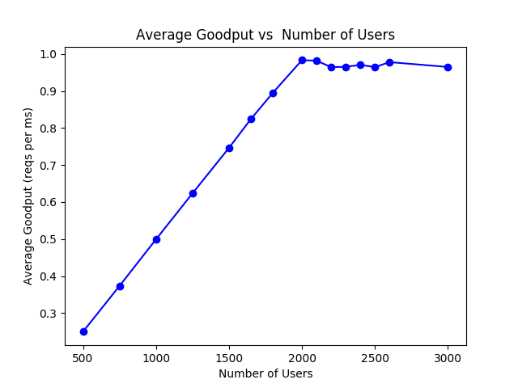
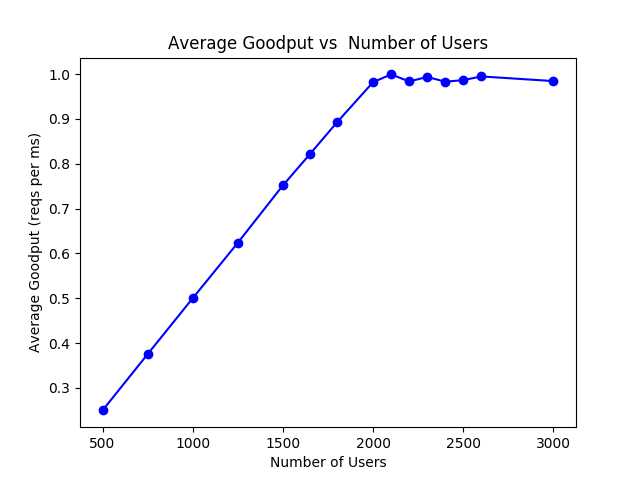

# Discrete Event Simulation of a Web Server assuming closed system
	A python implementation of simulation of a closed loop web server with context switches and timeouts.

## Features
- Multi-core and multi threaded server machine
- Round robin & First come first serve (FCFS) policies for scheduling accounting context switch overhead
- Users are in a standard closed loop - issue request, wait for response, think then issue request again.
- Options of having deterministic, exponential, uniform and constant+exponential distribution for think time, service time and timeout
- Request Timeouts are implemented in two ways
	- **TimeoutAtWriting**, where server gets to know that timeout has happened only at the time of writing results to socket.
	- **TimeoutBeforeWriting**, where server proactively checks for timeout at the beginning of every slot provided to that request.

## Metrics being collected (averages)
- Response time
- Number of users in system
- Utilization 
- Throughput
- Goodput
- Badput
- Request drop rate
- Context switched per request

## Dependencies
- Make sure you have python3.5 & pip3 installed
Install these dependencies
- statistics	```pip3 install statistics```
- matplotlib	```pip3 install matplotlib```
- yaml			```pip3 install pyyaml```
If you get environment error, then use ```pip3 install pyyaml --user``` and similarly for other dependencies.

## Instructions to run
1. There are two folders in directory Code, TimeoutAtWriting and TimeoutBeforeWriting containing their respective codes as mentioned above.
2. Change directory to one of these and then:
	- If you want to change the configuration of the system, make changes in config.yaml
	- python3 main.py <num_users> <result_file> <log_needed> e.g., ```python3 main.py 1500 results.txt 0```.
	- Otherwise, If you want to generate plots by varying number of users, then
		- Run ```python3 overall_script.py``` (You may want to change the number of users in the array users in overall_script.py). It will take around 2 minutes to run and will save all plots in folder Results

## Few Plots



## TODO
1. Use Welch’s procedure to discard transient phase instead of current ad-hoc choice.
2. Add more realistic features to the system like I/O.